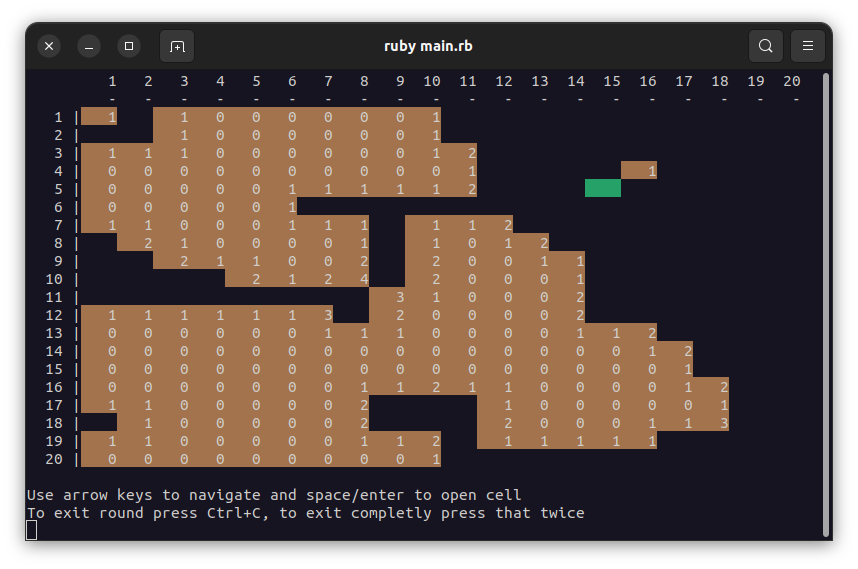
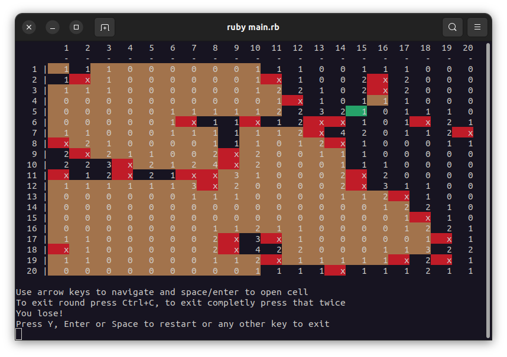

# RubyProxx

(MineSweeper) Console game implemented on Ruby.
Based on proxx.app game.

## Install
```bash
git clone
cd ruby_proxx
bundle install
```

## Run
```bash
ruby main.rb
```

## Rules
You have to open all cells without holes (mines).

## Controls
Use arrows to move cursor.
Use enter/space to open cell.
Use ctrl + c and enter/space to restart game.
Use double ctrl + c to exit game.

## Screenshots



## Tests (Rspec)
```bash
bundle exec rspec spec/proxxlike_spec.rb
```

## License
[MIT](https://choosealicense.com/licenses/mit/)

## Author
[Andrew Guk](https://github.com/gukandrew)
